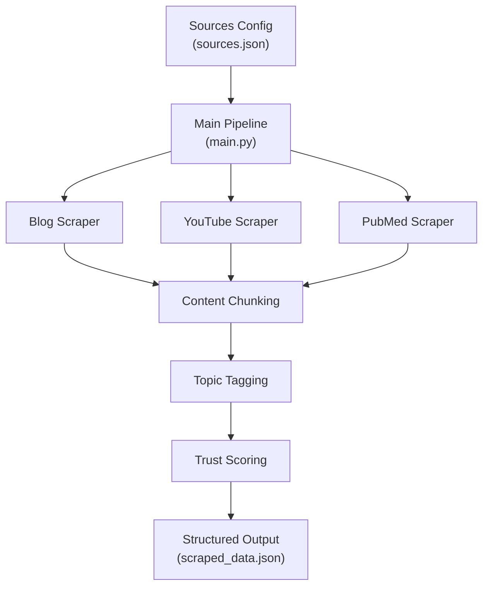

#  Multi-Source Medical AI Data Pipeline with Trust Scoring

## Overview

This project implements a **production-style data pipeline** that collects, processes, and evaluates information from multiple content sources in the domain of:

> **AI-based Chest X-ray Analysis (Pneumonia Detection)**

Unlike typical scraping tasks, the objective here is not just data collection — it is to **evaluate the reliability of each source using a structured, explainable trust scoring system**.

The pipeline integrates:

* Multi-source data ingestion (blogs, YouTube, PubMed)
* Content processing and segmentation
* Hybrid topic tagging
* A rule-based trust scoring engine

The final output is a **structured JSON dataset** that captures both content and credibility.

---

## Domain Selection Rationale

The domain was chosen from 8 medical imaging sub-domains based on:

* **Strong cross-source coherence**
  The PubMed paper (Kermany et al., Cell 2018) released the dataset referenced across blogs and videos.

* **Natural credibility variation**
  Sources range from peer-reviewed research to commercial blog content, enabling meaningful trust scoring.

* **Real-world relevance**
  Pneumonia detection from chest X-rays is a widely studied and impactful medical AI problem.

---

## Sources & Credibility Distribution

| Source                      | Type        | Key Characteristics                 | Trust Score |
| --------------------------- | ----------- | ----------------------------------- | ----------- |
| PubMed (Cell, 2018)         | Scientific  | Peer-reviewed, dataset origin       | **0.76**    |
| Stanford Medicine           | Blog (.edu) | Institutional but non-expert author | **0.66**    |
| Towards Data Science        | Blog        | Technical article with disclaimer   | **0.475**   |
| Two Minute Papers           | YouTube     | High-subscriber educational channel | **0.495**   |
| Medium (Augmented Startups) | Blog        | Commercial content, no disclaimer   | **0.385**   |
| Gaurav Kumar Jain           | YouTube     | Small creator demo                  | **0.3425**  |

### Key Insight

> High domain authority does not guarantee high credibility.

Stanford (.edu) scores lower than PubMed because:

* The article is written by a **communications office**, not researchers
* No medical disclaimer is present

This demonstrates that the system evaluates **content-level signals, not just domain prestige**.

---

## Pipeline Architecture

```text
sources.json → main.py → Scrapers → Chunking → Tagging → Trust Scoring → scraped_data.json
```

### Key Design Decision

* **Config-driven architecture (`sources.json`)**

  * Sources can be changed without modifying code
  * Separates configuration from logic
  * Mirrors production data pipeline design patterns



---

## Scraping Strategy

A **hybrid scraping approach** is used to handle diverse and unreliable web sources:

### Blogs

* Combination of **BeautifulSoup** and **newspaper3k**
* Site-specific logic for Stanford, TDS, and Medium
* Medium uses a **3-tier fallback system**:

  1. Live scraping
  2. newspaper3k
  3. Saved HTML (anti-scraping fallback)

---

### YouTube

* Uses **YouTube Data API v3** for metadata
* Extracts subscriber count for trust scoring
* Transcript extraction with fallback:

  ```
  manual transcript → auto transcript → description
  ```

⚠️ Due to YouTube bot detection (2025/2026), both videos used **description fallback**.

---

### PubMed

* Uses **NCBI Entrez API (Biopython)**
* Structured MEDLINE records
* Extracts:

  * authors (multi-author support)
  * journal
  * abstract
  * publication year

---

## Content Processing

### Chunking Strategy

Different strategies are applied based on content type:

* **Blogs** → paragraph-based chunking
* **YouTube** → word-based chunking (300 words)
* **PubMed** → sentence-based chunking

This ensures chunks are **semantically meaningful and usable for downstream tasks**.

---

### Topic Tagging

A **hybrid tagging approach** is used:

* **Keyword Matching**

  * 50+ domain-specific medical AI terms
* **TF-IDF Extraction**

  * Identifies statistically relevant terms

Final tags are:

* deduplicated
* capped at 8 per source

---

## Trust Scoring System

Each source is assigned a score between **0 and 1** based on:

```text
Trust Score =
  0.25 × Domain Authority +
  0.25 × Author Credibility +
  0.20 × Recency +
  0.15 × Citation Strength +
  0.15 × Medical Disclaimer
```

---

### Design Highlights

* **Multi-factor evaluation**
  → Combines structural, temporal, and contextual signals

* **Multi-author handling**
  → PubMed authors are scored individually and averaged

* **Credibility-aware recency**
  → Low-quality sources cannot game the system by being recent

* **YouTube credibility proxy**
  → Subscriber count used as a signal of influence

---

### Abuse Prevention

The system penalizes:

* SEO spam patterns
* Fake or suspicious author names
* Predatory domains
* Non-English content

Penalties are **multiplicative**, ensuring compounding effects.

---

## Edge Cases Handled

* Missing author → safe fallback with penalty
* Missing date → neutral recency handling
* Transcript unavailable → description fallback
* Medium anti-scraping → HTML fallback
* Multiple authors → averaged scoring
* No paragraph structure → sentence fallback

---

## Limitations

* YouTube transcript API blocked by platform restrictions
* Disclaimer detection is keyword-based (not semantic)
* Domain authority is heuristic-based
* Citation counts approximated for non-academic sources
* No retry/backoff for API failures

---

## How to Run

```bash
python -m venv venv
venv\Scripts\activate
pip install -r requirements.txt
python -c "import nltk; nltk.download('stopwords'); nltk.download('punkt')"
```

Create `.env` file:

```env
YOUTUBE_API_KEY=your_key
NCBI_EMAIL=your_email
```

Run pipeline:

```bash
python main.py
```

Output:

```text
output/scraped_data.json
```

---

## Conclusion

This project demonstrates how a **multi-source data pipeline** can go beyond data collection to **evaluate information reliability in a structured and explainable way**.

The key insight is that:

> **Credibility is multi-dimensional and cannot be inferred from domain alone.**

By combining signals such as:

* domain authority
* author credibility
* recency
* disclaimers

the system produces a **more realistic and nuanced assessment of trust**.

The pipeline is:

* modular
* configurable
* extensible

making it suitable for scaling to new domains or integrating more advanced models in the future.

---

## Author

**Aviral Gupta**<br>
AI/ML Internship Candidate
